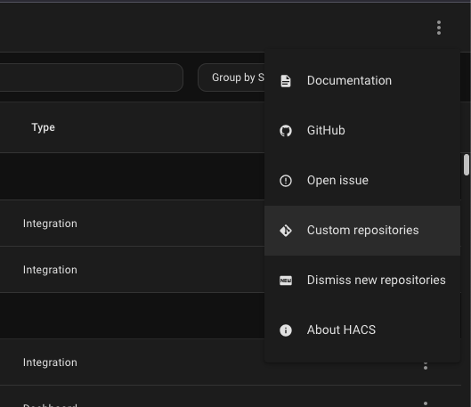
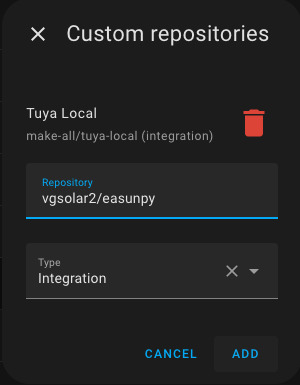
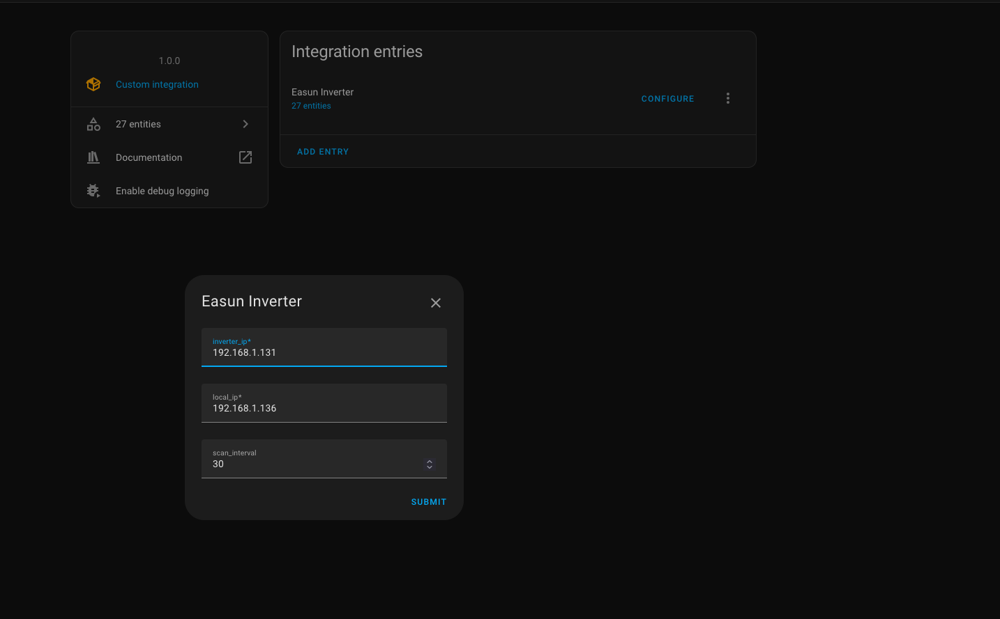
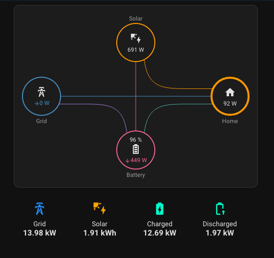

# EasunPy

**DISCLAIMER:** This is a personal project for local monitoring of Easun ISolar inverters and has no affiliation with EASUN POWER CO., LTD or any related companies. This project is shared "as is" without any warranty or commitment to maintenance. Use at your own risk.

This project is open source and shared with no commercial interest. It is intended for personal use and educational purposes only.

EasunPy is a Python library and monitoring tool for Easun ISolar inverters. It provides both a command-line interface for monitoring and a Home Assistant integration through HACS.

[](https://my.home-assistant.io/redirect/hacs_repository/?owner=vgsolar2&repository=easunpy&category=green+energy)

## Features

- Auto-discovery of inverters on the network
- Real-time monitoring of:
  - Battery status (voltage, current, power, SOC, temperature)
  - Solar status (PV power, charging, daily/total generation)
  - Grid status (voltage, power, frequency)
  - Output status (voltage, current, power, load)
  - System status (operating mode, inverter time)
- Home Assistant integration via HACS
- Interactive dashboard for continuous monitoring
- Simple output mode for scripting

## Home Assistant Integration

### Installation via HACS (Manual Repository)

1. Open HACS in your Home Assistant instance
2. Click the three dots in the top right corner and select "Custom repositories"
3. Add the repository URL as shown:
   
4. Select "Integration" as the category and click "Add"
   
5. The integration will now appear in HACS
6. Install it and restart Home Assistant

### Configuration

1. Go to Settings > Devices & Services
2. Click "Add Integration"
3. Search for "Easun Inverter"
   
4. Follow the configuration steps:
   - The integration will attempt to auto-discover your inverter
   - If auto-discovery fails, you can manually enter the inverter IP
   - Configure the update interval (minimum 15 seconds)

### Example Dashboards

The repository includes two example dashboard configurations:

1. `ha-cockpit.yaml` - A simple dashboard that groups all sensors without any additional dependencies
2. `ha-dashboard.yaml` - A more advanced dashboard with energy flow visualization (requires additional dependencies)
   

## Quick Start with `monitor.sh`

The `monitor.sh` script provides an easy way to start monitoring your inverter. It supports both auto-discovery and manual configuration.

### Basic Usage

```bash
# Auto-discover inverter and show single update
./monitor.sh

# Show continuous dashboard view
./monitor.sh --continuous

# Specify inverter IP manually
./monitor.sh --inverter-ip 192.168.1.100

# Specify local network interface
./monitor.sh --local-ip 192.168.1.2

# Custom update interval
./monitor.sh --interval 10 --continuous
```

### Command Line Options

- `--inverter-ip IP`: Manually specify inverter IP address
- `--local-ip IP`: Manually specify local network interface
- `--interval N`: Update interval in seconds (default: 5)
- `--continuous`: Show interactive dashboard with continuous updates
- `--single`: Run once and exit (default mode)
- `--debug`: Enable debug logging
- `--help`: Show help message

## Development

### Requirements

- Python 3.9 or higher
- `rich` library for dashboard display
- `asyncio` for async operations

### Installation for Development

```bash
git clone https://github.com/yourusername/easunpy.git
cd easunpy
pip install -e .
```

## Contributing

Contributions are welcome! Please feel free to submit a Pull Request.

### Areas for Contribution

- Additional inverter features support
- Documentation improvements
- Bug fixes and testing
- UI/UX improvements

## License

This project is licensed under the MIT License - see the LICENSE file for details.

## Acknowledgments

Thanks to all contributors and the Home Assistant community for their support and feedback.

